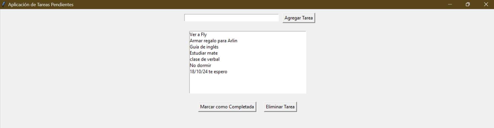

# Aplicación de administración de tareas

Descripción breve

## Modo de uso

¿Qué biblioteca debe tener instalada?
tkinter
¿Con qué comando se ejecuta el programa?
pyton ./Yaretfly/AplicacionTareas.py
¿En qué directorio debe encontrarse en la terminal para ejecutar el programa?
Donde haya copiado el repositorio

## Ejemplo de ejecución
Adjuntar una foto de ejecución del programa en su computadora

